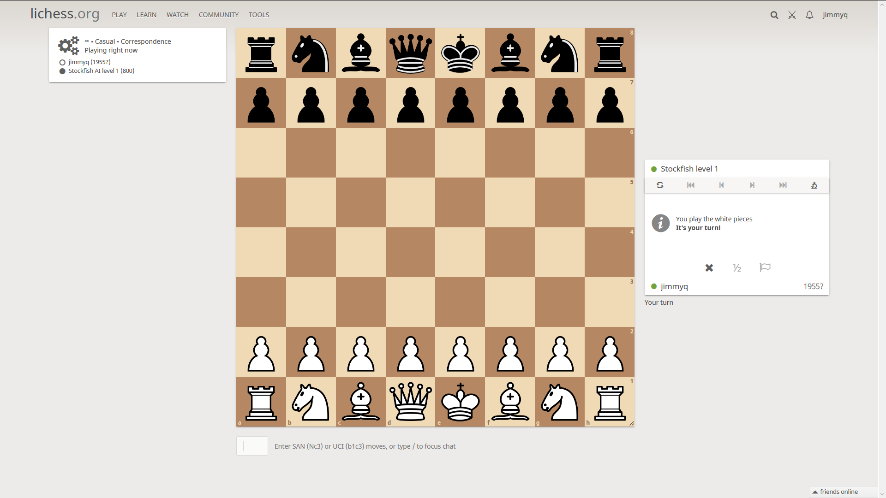

Play chess online using only your voice. Requires Windows 7/10.

## [Demo](https://www.youtube.com/watch?v=qTiGi9coW5A)

## Setup
1. lichess-osspeak uses the built-in Windows Speech Recognition engine. Make sure that the engine is enabled and spend at least a couple of minutes [training it](https://www.youtube.com/watch?v=R1NEbT-vMTo) to recognize your voice.
1. In the [Lichess game behavior menu](https://lichess.org/account/preferences/game-behavior), set the *Input moves with the keyboard* option to *Yes*. It is also recommended to turn off *Confirm resignation and draw offers*.
1. A keyboard navigation browser extension is suggested if you would like to nagivate the Lichess site by voice, including agreeing to/proposing draws and resigning games. Two good options are [Vimium](https://chrome.google.com/webstore/detail/vimium/dbepggeogbaibhgnhhndojpepiihcmeb?hl=en) for Chrome and [Surfingkeys](https://addons.mozilla.org/en-US/firefox/addon/surfingkeys_ff/) for Firefox.
1. Download the [latest release](https://github.com/osspeak/lichess-osspeak/releases/latest) of lichess-osspeak. Unzip the files and launch lichess-osspeak.exe.

## Usage

After completing setup step two, Lichess will add an input form to games that reads SAN (Nc3) or UCI (b1c3) and automatically makes the move in the game. lichess-osspeak functions by translating spoken commands (see below) into letters, numbers, and other keypresses. Notation for captures, checks, checkmates, and '=' for promotion are ignored. The text is treated as case-insensitive. 

Note that Lichess does not autofocus this field when a new game starts. Use one of the extensions in setup step 3 to do this in a hands-free way.

### Sample Commands
* `eureka four` - pawn to e4
* `eureka four danger five` - e4 pawn captures on d5
* `queen foxtrot seven` - queen to f7
* `knight bravo danger seven` - knight on the b file to d7 when there is an ambiguity. Equivalent to Nbd7.
* `rook one charlie six` - rook on the first rank to c6 when there is an ambiguity. Equivalent to R1c6.
* `queen gorilla four hotel five` - queen on the g4 square to h5 when there is an ambiguity. Equivalent to Qg4h5.
* `alpha eight queen` - pawn to a8 and promote to a queen

### All Commands

#### Pieces
* `bishop` - b
* `king` - k
* `knight` - n
* `queen` - q
* `rook` - r

#### Numbers (used primarily to specify algebraic notation ranks)
* `one` - 1
* `two` - 2
* `three` - 3
* `four` - 4
* `five` - 5
* `six` - 6
* `seven` - 7
* `eight` - 8
* `nine` - 9

#### Other in-game commaands
* `castle kingside` - o-o {enter} (enter is required to prevent automove when trying to castle queenside)
* `castle queenside` - o-o-o
* `reset` - Clear input form, useful when changing your mind before a move is fully entered
* `enter` - Press enter, this is how Lichess focuses the input form once the page has focus
* `escape` - Press escape, this unfocuses the input form

#### Letters (a through h are used to specify algebraic notation chess files, letters after h are primarily for hands-free browsing)
* `alpha` - a
* `bravo` - b
* `charlie` - c
* `danger` - d
* `eureka` - e
* `foxtrot` - f
* `gorilla` - g
* `hotel` - h
* `india` - i
* `juliet` - j
* `kilo` - k
* `lima` - l
* `michael` - m
* `november` - n
* `oscar` - o
* `peter` - p
* `quiet` - q
* `romeo` - r
* `sierra` - s
* `tango` - t
* `uniform` - u
* `victor` - v
* `whiskey` - w
* `xray` - x
* `yankee` - y
* `zulu` - z

#### Other commands

* `go to sleep` - Disable all other commands except `wake up`
* `wake up` - Enable all commands
* `start firefox` - Start Firefox
* `start chrome` - Start Chrome
* `open firefox` - Focuses Firefox
* `open chrome` - Focuses Chrome
* `go to lichess` - When a browser is open, navigates to lichess.org
* `go back` - Navigates to the previous page
* `go forward` - Navigates to the next page
* `go to top` - Scrolls to the top of the page
* `go to bottom` - Scrolls to the bottom of the page
* `Refresh page` - Reloads the current web page
